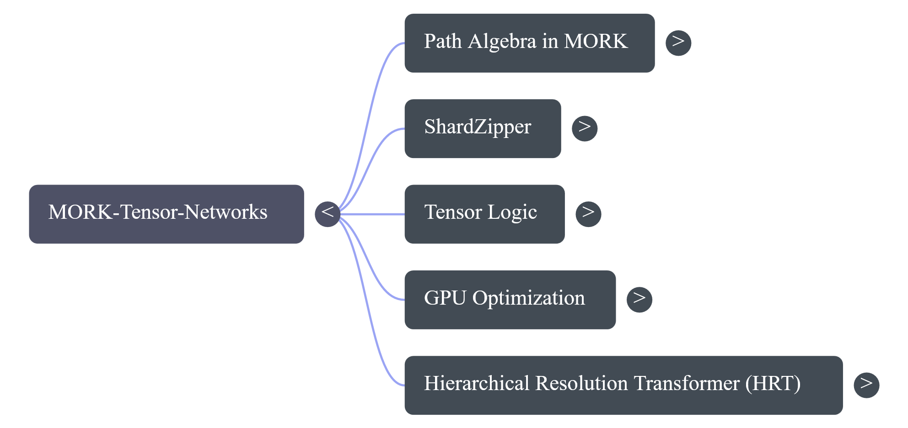
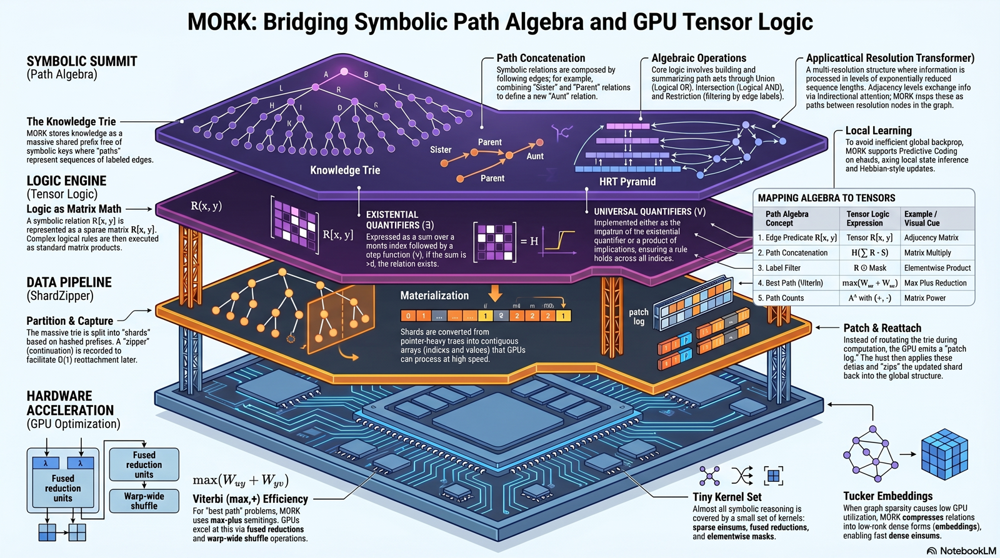

# Architecture

MORKTensorNetworks ports Goertzel's *"From Path Algebra in MORK to Tensor Logic on GPUs"*
(Oct 2025). The design is a **four-layer stack** that lowers symbolic knowledge into flat
GPU arrays, organized into **five categories**. Both views below; each component links to its
source file and current audit status.

## The five categories

| Category | Paper § | Source file(s) | Audit status |
|---|---|---|---|
| Path Algebra in MORK | §1 | `src/core/PathAlgebra.jl` | ✅ ops correct; GPU-compose contract noted (F1/F2) |
| ShardZipper | §2, §5.6 | `src/shard/ShardZipper.jl`, `src/shard/CrossShardJoin.jl` | ⚠️ materialize! rebuilt (H3); Capture Γ_s / O(1) reattach deferred (SZ-3/M2) |
| Tensor Logic | §3, §3.5, §4 | `src/core/Semirings.jl`, `src/core/PathAlgebra.jl` | ✅ 4 paper semirings law-correct; PLN/Cost are extensions (N1) |
| GPU Optimization | §5 | `src/gpu/SemiringKernels.jl`, `src/gpu/GPULayout.jl`, `src/decomp/TuckerDecomposition.jl` | ✅ kernels + Tucker correct; GPU threshold/Boolean contracts noted (G2/H2/L9) |
| HRT | §6 | `src/hrt/HRT.jl`, `src/hrt/PredictiveCodingTrainer.jl` | ⚠️ forward pass + recon correct; PC learns only W_down+alpha (N4) |

## The four-layer stack

The diagram reads top-down — symbolic knowledge is progressively lowered into flat GPU
arrays.

### 1. Symbolic Summit — Path Algebra (§1)
The **Knowledge Trie** is MORK's shared prefix-tree of symbolic keys; a *path* is a
sequence of labeled edges, and following a path composes relations (`Sister`∘`Parent` =
`Aunt`). **Algebraic operations** (union / intersection / restriction) build and summarize
path sets. The **HRT Pyramid** sits here as a multi-resolution structure (see layer 4).

Relations are decoded from trie atoms by `ShardZipper._decode_relation` (Rule-of-64 symbol
decode — the **H3** fix); path-algebra ops live in `src/core/PathAlgebra.jl`.

### 2. Logic Engine — Tensor Logic (§3)
A symbolic relation `R(x,y)` becomes a (sparse) matrix `R[x,y]`; logical rules execute as
**matrix products + a Heaviside `H`**. Existential `∃y` = row-sum then `H`; universal `∀y`
= `1 − H(Σ(1−Ψ))`. The semiring-aware Heaviside `_heaviside` (the **C2** fix) replaced a
hardcoded `>0` that was wrong for tropical semirings.

#### Mapping algebra → tensors

| # | Path Algebra | Tensor Logic | GPU primitive | Code |
|---|---|---|---|---|
| 1 | Edge predicate `R(x,y)` | `R[x,y]` | adjacency matrix | `materialize!` CSR |
| 2 | Path concatenation `R∘S` | `H(Σ_y R[x,y]S[y,z])` | matrix multiply | `path_compose` |
| 3 | Label filter | `R ⊙ Mask` | elementwise product | `path_restrict` |
| 4 | Best path (Viterbi) | `max_y(W[u,y]+W[y,v])` | max-plus reduction | `path_viterbi` |
| 5 | Path counts | `A^k` with (+,·) | matrix power | `path_count` |

### 3. Data Pipeline — ShardZipper (§2)
**Partition & Capture**: the trie is split into shards by prefix; a zipper continuation Γ_s
is *meant* to enable O(1) reattach. **Materialization**: pointer-heavy subtries → contiguous
CSR arrays. **Patch & Reattach**: the GPU emits a *patch log* of deltas; the host applies
them and splices the shard back.

Code: `src/shard/ShardZipper.jl` (`partition_trie`, `capture_shard`, `materialize!`,
`compute!`, `patch_and_reattach!`, `should_adapt`). Partition uses a child-mask iterator
(the **H4** fix). Capture does not yet record Γ_s and reattach does per-path writes, not the
O(1) graft (**SZ-3 / M2**, tracked in TODO).

### 4. Hardware Acceleration — GPU Optimization (§5)
A **tiny kernel set** (sparse einsums, fused reductions, elementwise masks) covers almost
all reasoning. **Viterbi (max,+)** uses fused reductions + warp-wide shuffles. **Tucker
embeddings** densify low-rank relations when sparsity hurts GPU utilization.

Code: `src/gpu/SemiringKernels.jl` (SpGEMM/SpMV/reduce/mask/threshold),
`src/gpu/GPULayout.jl` (CSR/BCSR), `src/decomp/TuckerDecomposition.jl` (2/3/N-mode HOOI).
GPU Boolean (`max`/`min`) and `threshold_kernel!` (`>thresh`) are not semiring-aware on
non-{0,1} / tropical data (**H2 / G2 / L9**) — sound for the active SumProduct/Boolean path,
documented for the rest.

#### Dense-output SpGEMM — scale limit and the fail-loud guard

`gpu_semiring_spmm` materializes a **dense** `m × n` output (it deliberately dodges the hard
SpGEMM symbolic phase). Measured (R∘R at fixed average degree 27): output density falls as
`d²/n` and the dense-vs-sparse memory waste grows linearly as `n/d²`. At small scale R² is
50–76 % dense, so dense output is the *right* choice (waste ≈ 1×; the kernel's "competitive
above ~10 %" note is empirically exact). But at metagraph scale it is a hard wall — a
fly-brain-sized relation (n ≈ 139 k, degree 27) would need **77.6 GB dense vs 0.81 GB sparse
(191×)**. The sparse-output variant (two-pass symbolic-then-numeric SpGEMM) is **not yet
built** — pulled-by-need; nothing routes a contraction at that scale today. Meanwhile
`gpu_semiring_spmm` takes a `max_dense_bytes` keyword (default 4 GiB) and **errors actionably**
when the dense output would exceed it, rather than OOMing silently (**C4**).

### Cross-cutting — Local Learning (§6.4)
To avoid global backprop, HRT trains via **Predictive Coding** (local error + Hebbian
updates) in `src/hrt/PredictiveCodingTrainer.jl`. Currently only `W_down` + fusion gates
learn; attention/FFN weights are frozen (**N4**, tracked in TODO).

## Audit & open items
The authoritative finding-by-finding record is `docs/AUDIT_2026-06-04.md`; tracked open
items and owner decisions are in `docs/TODO.md` (both in the repo root `docs/`).

Verified at last audit: `Pkg.test` 129/129 (incl. Aqua), warm-REPL 120/120, Blue fixed point.
